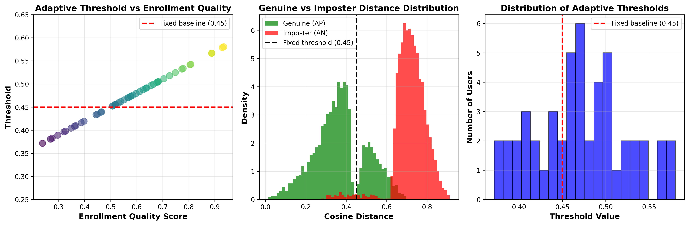

# Voice Authentication with Adaptive Threshold Selection

This project implements a **speaker verification system** using the **You-Only-Speak-Once (YOSO / FBankNet)** architecture as a baseline and introduces a **new adaptive thresholding mechanism** that personalizes authentication thresholds based on the quality of enrollment audio.

The adaptive threshold improves **genuine-user acceptance** while maintaining **strong security (imposter rejection)**, addressing a key limitation of systems that use a single global decision threshold.

---

## 📌 Key Features

- CNN-based speaker embedding model using **64×64 Mel-filterbank (FBank) features**
- Two-stage training:
  - **Cross-entropy pre-training**
  - **Triplet loss fine-tuning**
- **Adaptive Threshold Algorithm** for per-user authentication thresholding
- Real-time verification pipeline with cosine distance scoring
- Fully reproducible evaluation and visualizations

---

## 🧠 System Architecture

Audio → Preprocessing (VAD, normalization)
→ Filterbank Extraction (64 x 64)
→ FBankNet CNN → Speaker Embedding (250-d)
→ Distance Comparison (Cosine)
→ Threshold Decision (Fixed vs Adaptive)

---

## 🎯 Baseline Model (YOSO / FBankNet)

| Component | Description |
|----------|-------------|
| Sampling Rate | 16 kHz mono |
| Feature Window | 25 ms frame, 10 ms stride |
| Features | 64 Mel Filterbank coefficients |
| Model | CNN + Residual Blocks |
| Embedding Size | 250 dimensions |
| Loss (Fine-tuning) | Triplet Loss (margin = 0.2) |

Baseline distance distributions:

| Pair Type | Mean | Std |
|----------|------|-----|
| Same Speaker (Genuine, AP) | 0.39 | 0.02 |
| Different Speaker (Imposter, AN) | 0.93 | 0.04 |

Baseline fixed threshold:
T_fixed = μ_AP + 3σ_AP ≈ 0.45

---

## 🔄 Adaptive Threshold Method (Our Contribution)

Different users enroll in different environments → enrollment **quality varies**.

We estimate **enrollment quality Q** based on pairwise distances between embeddings:

Q = 1.0 - (mean_dist + weighted_variance)

Then assign a **personalized threshold**:

T = 0.45 + (Q - 0.5) × 0.30
T clipped to [0.30, 0.60]

| Quality (Q) | Threshold Behavior |
|------------|-------------------|
| High (Q > 0.6) | Stricter threshold → higher security |
| Medium | Uses baseline |
| Low (Q < 0.4) | Looser threshold → reduces false rejects |

---

## 📊 Results

| Method | Positive Accuracy (Genuine Accepted) | Negative Accuracy (Imposters Rejected) |
|--------|--------------------------------------|----------------------------------------|
| **Fixed Threshold (0.45)** | **74.0%** | **97.6%** |
| **Adaptive Threshold (Ours)** | **76.2%** | **97.4%** |

**Improvement:**  
✅ +2.2% *better user acceptance*  
⚖️ −0.3% *negligible change to security*

---

## 🖼 Visualizations

Extract FBank Features
python preprocess.py --input data/ --output features/

Run Verification
python verify.py --enroll user.wav --test test.wav

Run Web Demo (Flask)
$env:FLASK_APP="fbank_net.demo.app"
flask run

References

Schroff et al. FaceNet, CVPR 2015.

Li et al. DeepSpeaker, 2017.

Panayotov et al. LibriSpeech, ICASSP 2015.
